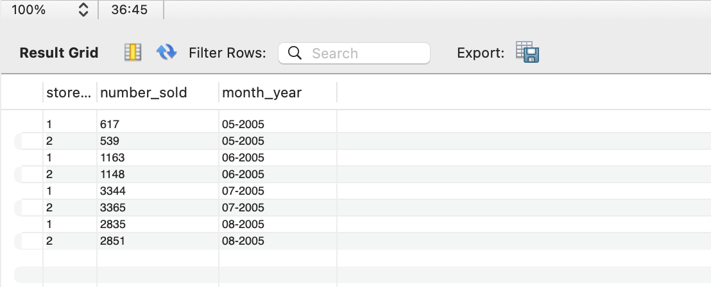

# SQL-SDA24
 
## 1ère partie -- Base de données Sakila

1. Tous les acteurs dont le nom de famille contient les lettres 'gen'
```sql
select * from sakila.actor
where lower(last_name) like '%gen%';
```


2. Tous les acteurs dont le nom de famille contient les lettres 'li'
```sql
select * from sakila.actor
where lower(last_name) like '%li%';
```


3. Liste des noms de famille de tous les acteurs, ainsi que le nombre d'acteurs portant chaque nom de famille
```sql
select last_name, count(*)
from sakila.actor
group by last_name;
```


4. Liste des noms de famille des acteurs et le nombre d'acteurs qui portent chaque nom de famille, mais seulement pour les noms qui sont portés par au moins 2 acteurs
```sql
select last_name, count(*)
from sakila.actor
group by last_name 
having count(*) >= 2;
```


5. Utilisez JOIN pour afficher le montant total perçu par chaque membre du personnel en août 2005
```sql
select p.staff_id, s.first_name, s.last_name, sum(p.amount)
from sakila.staff s join sakila.payment p on s.staff_id = p.staff_id
where date_format(p.payment_date, '%Y-%m') = '2005-08'
group by p.staff_id, s.first_name, s.last_name;
```


6. Afficher les titres des films commençant par les lettres K et Q dont la langue est l'anglais
```sql
select distinct f.title
from sakila.film f, sakila.language l
where 
	lower(f.title) like 'k%' or lower(f.title) like 'q%'
	and f.language_id = l.language_id and l.name = 'English';
```


7. Affichez les noms et les adresses électroniques de tous les clients canadiens
```sql
select c.last_name, c.email, c.email, a.address, a.district, ci.city, a.postal_code, co.country 
from sakila.customer c, sakila.city ci, sakila.address a, sakila.country co
where 
	c.address_id = a.address_id and ci.city_id = a.city_id 
	and co.country_id = ci.country_id and co.country = 'Canada';
```


8. Quelles sont les ventes de chaque magasin pour chaque mois de 2005 (CONCAT)
```sql
select s.store_id, count(p.payment_id) as number_sold, concat('0',month(p.payment_date),'-',year(p.payment_date)) as month_year
from sakila.payment p, sakila.staff st, sakila.store s
where 
	p.staff_id = st.staff_id 
    and st.store_id = s.store_id
	and year(p.payment_date) = 2005
group by concat('0',month(p.payment_date),'-',year(p.payment_date)), s.store_id
order by concat('0',month(p.payment_date),'-',year(p.payment_date)) asc;
```


9. Trouvez le titre du film, le nom du client, le numéro de téléphone du client et l'adresse du client pour tous les DVD en circulation (qui n'ont pas prévu d'être rendus)
```sql
select distinct f.title, concat(c.first_name, ' ', c.last_name) as name, a.phone, concat(a.address, ' ', a.district, ' ', a.postal_code, ' ', ci.city, ' ', co.country) as address
from sakila.rental r
	join sakila.customer c 
		on r.customer_id = c.customer_id
	join sakila.address a
		on a.address_id = c.address_id
	join sakila.inventory i
		on i.inventory_id = r.inventory_id
	join sakila.film f
		on f.film_id = i.film_id
	join sakila.city ci 
		on ci.city_id = a.city_id
	join sakila.country co
		on co.country_id = ci.country_id
where r.return_date is null;
```


## 2è partie -- Test technique (type entreprise)

1. How can SQL queries be optimized ? 

	12 best practices : 
	- Use indexes effectively
	- Avoid `SELECT *` and retrieve only necessary columns
	- Optimize `JOIN` operations
	- Minimize the use of subqueries
	- Avoid redundant or unnecessary data retrieval
	- Utilize stored procedures
	- Consider partitioning and sharding
	- Normalize database tables
	- Monitor query performance
	- Use `UNION ALL` instead of `UNION`
	- Optimize subquery performance
	- Leverage cloud database-specific features

2. How do you remove duplicate rows from a table ? 

	- **Method 1 :** Run the following script : 
		```sql 
		SELECT DISTINCT *
		INTO duplicate_table
		FROM original_table
		GROUP BY key_value
		HAVING COUNT(key_value) > 1

		DELETE original_table
		WHERE key_value
		IN (SELECT key_value
		FROM duplicate_table)

		INSERT original_table
		SELECT *
		FROM duplicate_table

		DROP TABLE duplicate_table
		```
		This script takes the following actions in the given order:
		- Moves one instance of any duplicate row in the original table to a duplicate table.
		- Deletes all rows from the original table that are also located in the duplicate table.
		- Moves the rows in the duplicate table back into the original table.
		- Drops the duplicate table.
	- **Method 2 :** The `ROW_NUMBER` function that was introduced in Microsoft SQL Server 2005 makes this operation much simpler:
		```sql
		DELETE T
		FROM
		(
		SELECT *
		, DupRank = ROW_NUMBER() OVER (
					PARTITION BY key_value
					ORDER BY (SELECT NULL)
					)
		FROM original_table
		) AS T
		WHERE DupRank > 1
		```
	- **OTHER METHODS:**
		- SQL delete duplicate Rows using Group By and Having clause --> Use the SQL GROUP BY clause to identify the duplicate rows. The Group By clause groups data as per the defined columns and we can use the COUNT function to check the occurrence of a row;

		- SQL delete duplicate Rows using Common Table Expressions (CTE) --> Use Common Table Expressions commonly known as CTE to remove duplicate rows in SQL Server. It is available starting from SQL Server 2005;

		- RANK function to SQL delete duplicate rows --> Use the SQL RANK function to remove the duplicate rows as well. SQL RANK function gives unique row ID for each row irrespective of the duplicate row;

		- Use SSIS package to SQL delete duplicate rows --> Use Sort Operator in an SSIS package for removing duplicating rows.

3. What are the main differences between HAVING and WHERE SQL clauses ? 

	The main difference between WHERE and HAVING clause is that the WHERE clause allows you to filter data from specific rows (individual rows) from a table based on certain conditions. 
	
	In contrast, the HAVING clause allows you to filter data from a group of rows in a query based on conditions involving aggregate values.

	|Where|Having|
	|-|-|
	|filters by each row|filters by each group|
	|processed before any grouping|processed after any grouping|
	|cannot have aggregate functions|can have aggregate functions|
	|can be used in SELECT, INSERT, UPDATE, DELETE statements|can only be used in SELECT statements|
	|written before GROUP BY clause|written after GROUP BY clause|


4. What is the difference between normalization and denormalization ?

	The goal of normalization is to minimize data redundancy and dependency by organizing data into well-structured tables.
	
	Denormalization involves combining tables that have been normalized to improve query performance and simplify data retrieval.

	||Normalization|Denormalization|
	|-|-|-|
	|Implementation|Decomposes data into different tables to reduce redundancy|Combines data to improve the access time|
	|Query execution speed|Speed of update, delete and write operations is higher|Speed of read operations is higher, but that of update and write operations is slower|
	|Memory consumption|Memory consumption is less as data redundancy is less|Memory consumption is more as redundancy is introduced|
	|Number of tables|Number of tables is more on account of decomposition of data|Combines data and hence number of tables are less|
	|Data integrity|Data integrity is maintained|Data integrity might not be maintained|

5. What are the key differences between the DELETE and TRUNCATE SQL commands ?

	DELETE is a SQL command that removes one or multiple rows from a table using conditions. 
	
	TRUNCATE is a SQL command that removes all the rows from a table without using any condition.

	|Truncate|Delete|
	|-|-|
	|It removes all rows from a table + faster + does not use as much undo space as a delete|It is used to remove rows from table. A WHERE clause can be used to only remove some rows|
	|It is a DDL command so this command change structure of table|It is a DML command. It only remove rows from a table, leaving the table structure untouched|
	|You cannot rollback in Truncate|In DELETE, you can rollback|
	|In SQL, the auto increment counter gets reset with truncate|The auto increment counter cannot get reset with delete|


6. What are some ways to prevent duplicate entries when making a query?

	To prevent duplicate entries when making a query, you can consider the following approaches:

	1. **Use `DISTINCT`**: When selecting data from a database, include the `DISTINCT` keyword in your SQL query. This will return only unique rows based on the columns you specify.

	```sql
	SELECT DISTINCT column1, column2 FROM table_name;
	```

	2. **Use Grouping**: Utilize the `GROUP BY` clause to group records by specific columns. This will aggregate results and can be combined with aggregate functions to eliminate duplicates.

	```sql
	SELECT column1, COUNT(*) FROM table_name GROUP BY column1;
	```

	3. **Implement Primary Keys and Unique Constraints**: In your database schema, define primary keys and unique constraints on columns where duplicates should not occur. This will automatically prevent the insertion of duplicate records.

	4. **Use `JOIN` with Care**: When joining tables, ensure you are joining on the correct keys and using appropriate conditions to avoid unintended duplication of rows.

	5. **Window Functions**: Use window functions to rank or number rows based on specific criteria, then filter out duplicates based on that ranking.

	```sql
	SELECT * FROM (
		SELECT *, ROW_NUMBER() OVER (PARTITION BY column1 ORDER BY column2) as rn
		FROM table_name
	) AS temp
	WHERE rn = 1;
	```


7. What are the different types of relationships in SQL?

	In SQL and relational database design, there are three main types of relationships that define how tables are related to each other:

	1. **One-to-One (1:1)**:
		- In a one-to-one relationship, a row in one table is linked to a single row in another table, and vice versa. 
		- This type of relationship is often used to split a table for normalization or to separate optional data.
		- **Example**: A `Users` table and a `UserProfiles` table, where each user has exactly one profile.

	2. **One-to-Many (1:N)**:
		- In a one-to-many relationship, a row in one table can be associated with multiple rows in another table, but a row in the second table is linked to only one row in the first table.
		- This is the most common type of relationship in relational databases.
		- **Example**: A `Customers` table and an `Orders` table, where each customer can have multiple orders, but each order is associated with only one customer.

	3. **Many-to-Many (M:N)**:
		- In a many-to-many relationship, multiple rows in one table can be related to multiple rows in another table. This type of relationship requires a junction (or linking) table to facilitate the relationship.
		- **Example**: A `Students` table and a `Courses` table, where a student can enroll in multiple courses, and a course can have multiple students. A junction table called `Enrollments` could be created to link students and courses.

	4. **Additional Concepts**:

		- **Self-Referencing Relationships**: A table may relate to itself in a one-to-one or one-to-many manner. For example, an `Employees` table where each employee can have a manager who is also an employee.
		
		- **Foreign Keys**: Relationships are typically enforced using foreign keys, which are fields in one table that refer to the primary key of another table. This ensures referential integrity.


## References
1. ThoughtSpot. (n.d.). Optimizing SQL queries: A guide to data modeling best practices. ThoughtSpot. Retrieved November 1, 2024, from https://www.thoughtspot.com/data-trends/data-modeling/optimizing-sql-queries
2. SQL Shack. (2021, March 30). Different ways to SQL delete duplicate rows from a SQL table. SQL Shack. Retrieved November 1, 2024, from https://www.sqlshack.com/different-ways-to-sql-delete-duplicate-rows-from-a-sql-table/
3. Microsoft. (n.d.). Remove duplicate rows from a SQL Server table. Microsoft Learn. Retrieved November 1, 2024, from https://learn.microsoft.com/en-us/troubleshoot/sql/database-engine/development/remove-duplicate-rows-sql-server-tab 