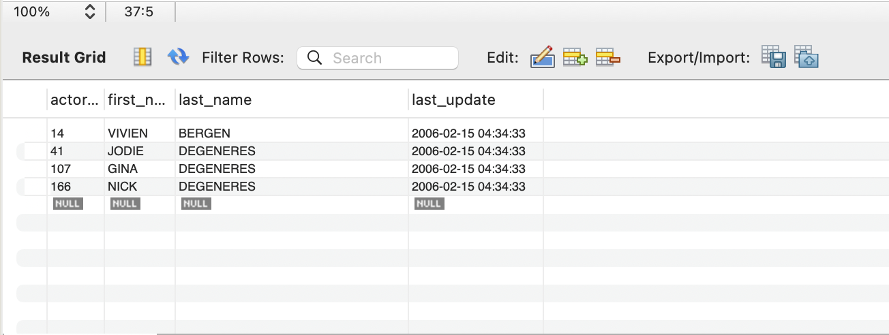

# SQL-SDA24
 
## 1ère partie -- Base de données Sakila

1. Tous les acteurs dont le nom de famille contient les lettres 'gen'
```sql
select * from sakila.actor
where lower(last_name) like '%gen%';
```



2. Tous les acteurs dont le nom de famille contient les lettres 'li'
```sql
select * from sakila.actor
where lower(last_name) like '%li%';
```


3. Liste des noms de famille de tous les acteurs, ainsi que le nombre d'acteurs portant chaque nom de famille
```sql
select last_name, count(*)
from sakila.actor
group by last_name;
```


4. Liste des noms de famille des acteurs et le nombre d'acteurs qui portent chaque nom de famille, mais seulement pour les noms qui sont portés par au moins 2 acteurs
```sql
select last_name, count(*)
from sakila.actor
group by last_name 
having count(*) >= 2;
```


5. Utilisez JOIN pour afficher le montant total perçu par chaque membre du personnel en août 2005
```sql
select p.staff_id, s.first_name, s.last_name, sum(p.amount)
from sakila.staff s join sakila.payment p on s.staff_id = p.staff_id
where date_format(p.payment_date, '%Y-%m') = '2005-08'
group by p.staff_id, s.first_name, s.last_name;
```


6. Afficher les titres des films commençant par les lettres K et Q dont la langue est l'anglais
```sql
select distinct f.title
from sakila.film f, sakila.language l
where 
	lower(f.title) like 'k%' or lower(f.title) like 'q%'
	and f.language_id = l.language_id and l.name = 'English';
```


7. Affichez les noms et les adresses électroniques de tous les clients canadiens
```sql
select c.last_name, c.email, c.email, a.address, a.district, ci.city, a.postal_code, co.country 
from sakila.customer c, sakila.city ci, sakila.address a, sakila.country co
where 
	c.address_id = a.address_id and ci.city_id = a.city_id 
	and co.country_id = ci.country_id and co.country = 'Canada';
```


8. 
```sql
select count(payment_id), month(payment_date) 
from sakila.payment 
group by month(payment_date) 
order by month(payment_date) asc;
```